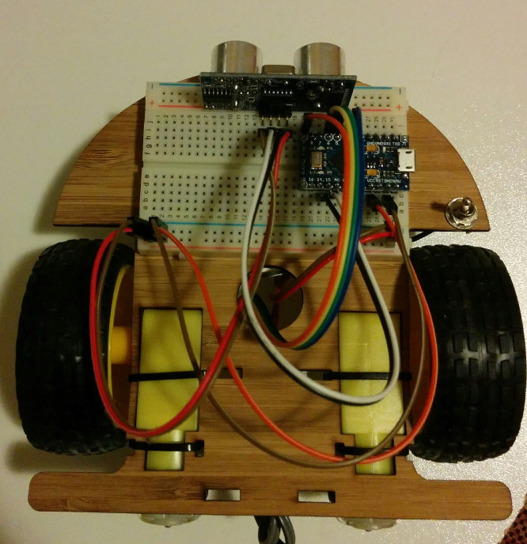
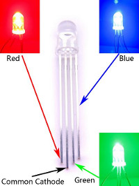
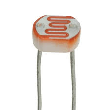
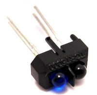
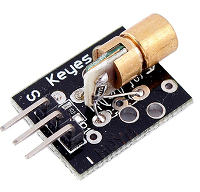

# ralph-robot

### Build your Ralph
You should have a chassis with a lithium battery, charging circuit and 5V booster & switch already attached. The circuitry looks after charging the battery (and cutting out when it gets too low) and converting its output volage (~3.8V) to 5V as required by the Arduino. There should be two red and two brown wires coming out of the 5V booster circuit. The red wires are 5V and the brown ones are Ground. One pair will power the motor driver while the other will power the arduino.
* 

1. Enjoy your kinder surprise! Snap the toy container in half and hot glue the longer half on the circle mark on the chassis. 
2. Attach the motors to the chassis with cable ties. 
3. Connect the wires from the motors to the motor driver using the screw mounts. With the chassis as shown in the photo, put the wire with the black line in it into the outer sockets for each motor (this ensures the wiring exactly matches up to the code we will write)
4. Connect the brown wire from the 5V booser to the pin marked GND on the motor driver. Connect the red wire to the pin marked VCC. 
5. Connect female-male wires to the remaining pins on the motor driver. Post the other end of the wires along with the 2nd ground and 5V wire from the booster through the hole in the center of your bot onto the upper side.
6. Fix the motor driver to your bot with double sided tape
7. Turn your bot over.
* 
8. Peel the backing off your breadboard and stick it onto the top side of your bot, above the kinder surprise. 
9. Put your Arduino on the breadboard such its pins are on either side of the groove down its center.
10. Mount the HC-SR04 ultrasonic sensor on the breadboard so that it faces forward (and does not overlap with any of the columns of pins used by the arduino).
11. Connect the blue, green, yellow and orange wires from the motor driver to pins 3,5,6 & 9 on the Arduino.
12. Connect the Trig and Echo pins on the ultra-sonic sensor to pins 14 & 15 on the Arduino.
13. Connect the Gnd and 5V wires from the 5V booster to pins in the -ve and +ve row respectively.
14. Connect the -ve row to Gnd on the ultrasonic sensor the Arduino.
15. Connect the +ve row to VCC on the ultrasonic sensor and the Arduino.
Congratulations. Your Hardware is ready to go! 

### Code
1. Download the arduino IDE from https://www.arduino.cc/en/Main/Software
2. Download the NewPing library from https://bitbucket.org/teckel12/arduino-new-ping/wiki/Home

### Taking things further
Your kit includes a bunch of parts to experiment with after the session. We've included some links to get you started with each component but don't be afraid to just mess about (and Google). 
- a pan-tilt mount with two servos (see https://learn.adafruit.com/mini-pan-tilt-kit-assembly/the-tilt-bracket for assembly instructions, and https://www.arduino.cc/en/Tutorial/Sweep for a simple introduction to controlling servos with Arduino)
- a (common cathode) red-greeb-blue light emmitting diode (RGB LED), https://learn.adafruit.com/downloads/pdf/adafruit-arduino-lesson-3-rgb-leds.pdf

 
- a light dependent resistor (LDR), http://bildr.org/2012/11/photoresistor-arduino/

- a reflective optical sensor (TCRT5000), http://blog.huntgang.com/2014/06/17/arduino-tcrt5000-build-ir-sensor/

- a laser module! (To blink it on and off, connect - to Ground and the S pin to a digital pin on the Arduino - and use the Blink code).

 
